# stacks-on-stacks

## Description 
Oink! is a personal finance tracking application. Here, a user can record and see their total monthly income and expenses as well as create a budget goal for the month. The user also has the benefit of seeing their past income, expenses, and projected budget activity.

## Badges

 

 

 
 

 

## Table of Contents 

[Installation](#installation) 
[Usage](#usage) 
[Support](#support) 
[Roadmap](#roadmap) 
[Acknowledgements](#acknowledgements) 
[License](#license) 
[Status](#project-status)

## Installation 

In order to enjoy this application, the user simply needs to select the following link: https://guarded-gorge-65763.herokuapp.com/ .

## Usage 

The user can access the application website here : https://guarded-gorge-65763.herokuapp.com/ .

This application is formatted for desktop computers, laptop computers, and mobile phones. 

When the user opens the application, they will see the homepage where they can sign-in or sign-up by selecting the signin/signup link at the bottom of the page. 
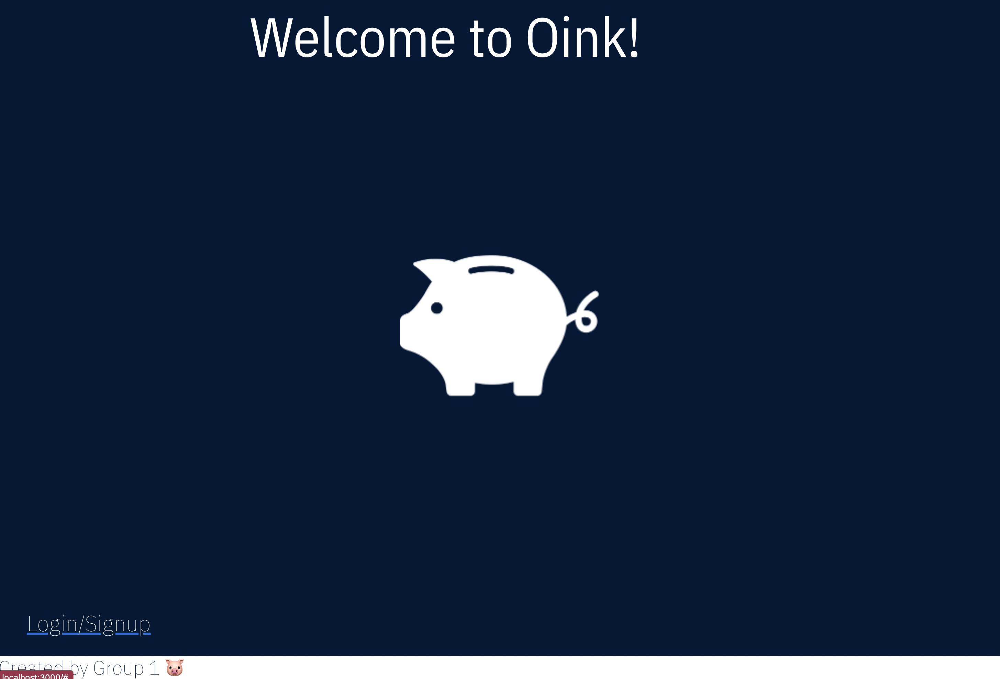

When the user selects the link, a modal will appear. If the user selects signup, then they will recieve the form to signup. 
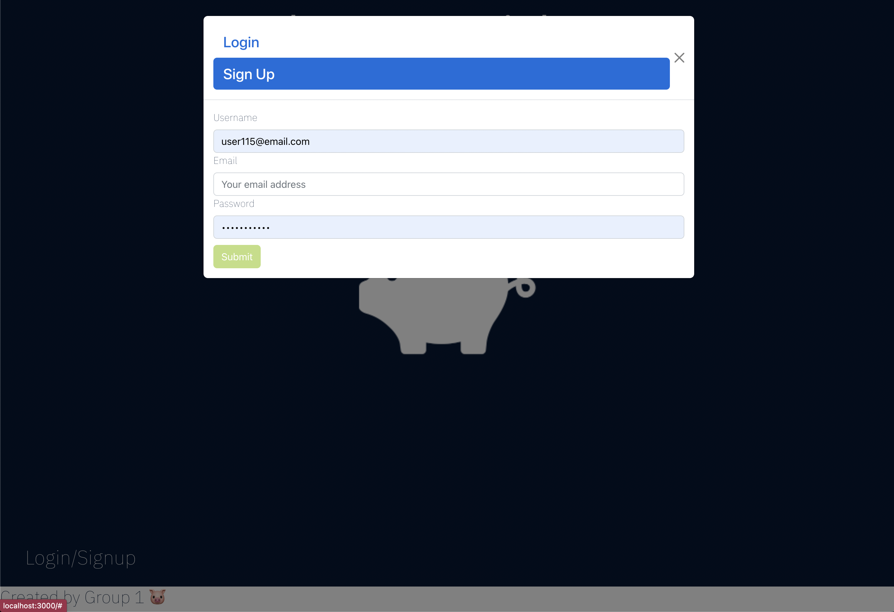

If the user has already signed up, but would like to sign in, they can select singin, and will reciece the form to login. 
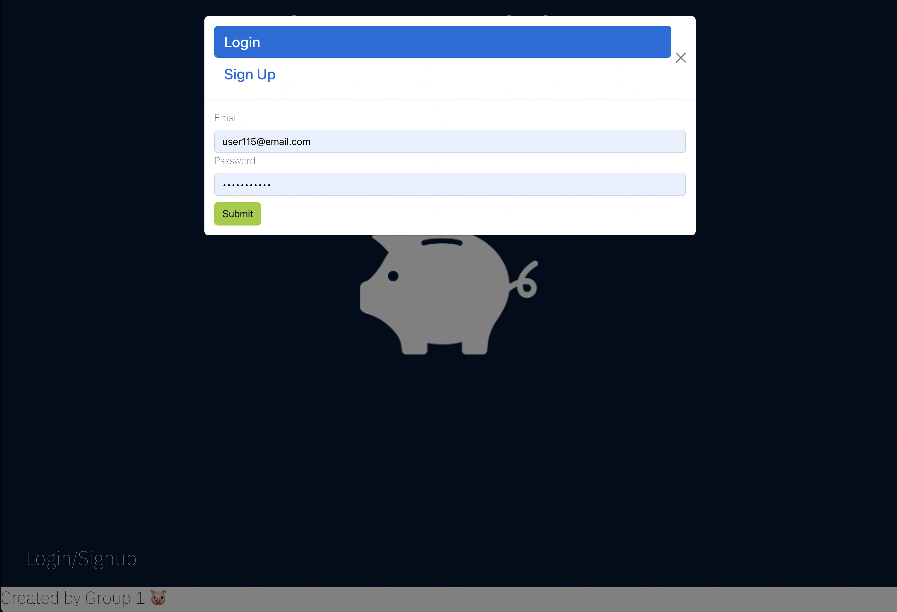

Once the user has either signed in or signed up, they will see the dashboard. 
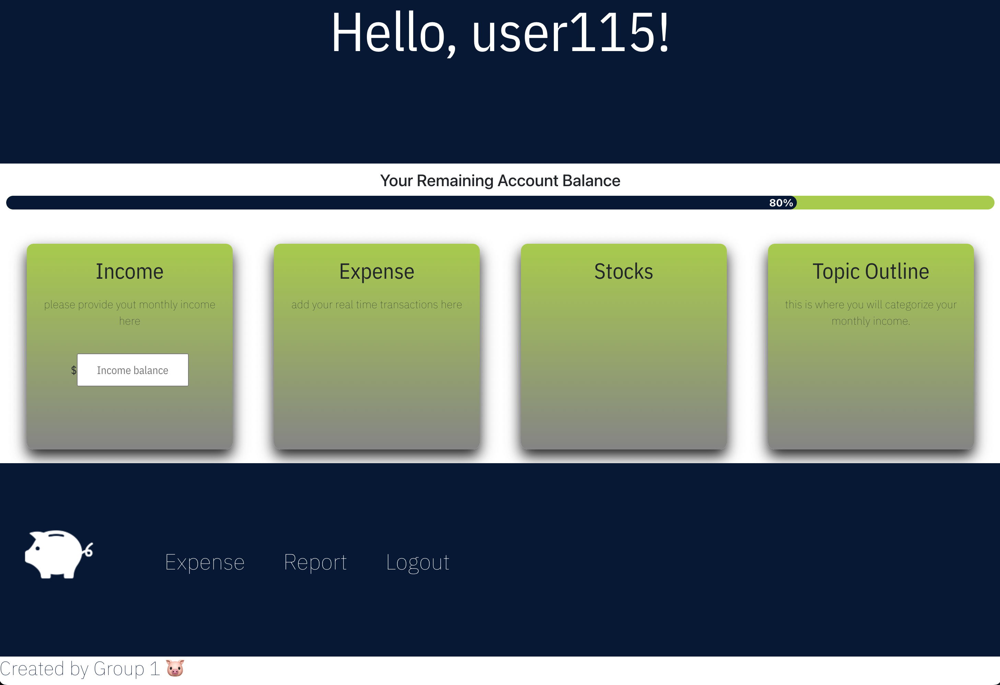
The dashboard includes a summary of each section as well as the option to input your monthly income. 

The user will also see a progress bar just underneath the header, this display how the user's overall spending compares to their income. This feature, like the header, footer, and navigation bar will persist on the screen as the user switches between sections. 
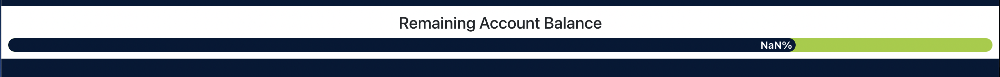

The navigation bar to acces the other sections is located at the bottom of the webpage. When the user selects the report section, they will access their monthly budget report. Here, the user can set their budget for the month and see how their actual spending compares to their budget. A user can access their total income and total expenses for one day by selecting that day on the calendar at the top of the page and viewing the modal. 
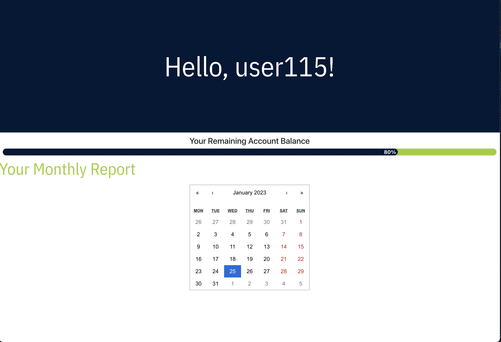
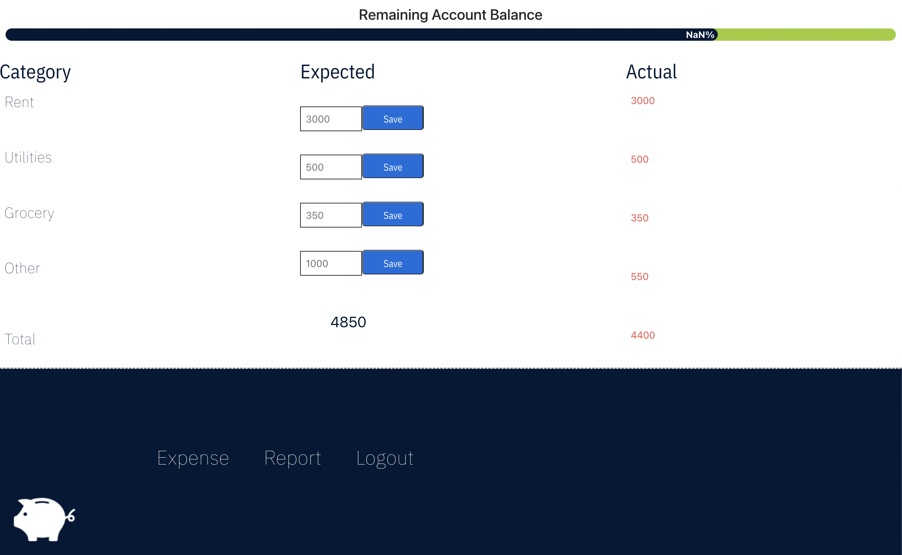
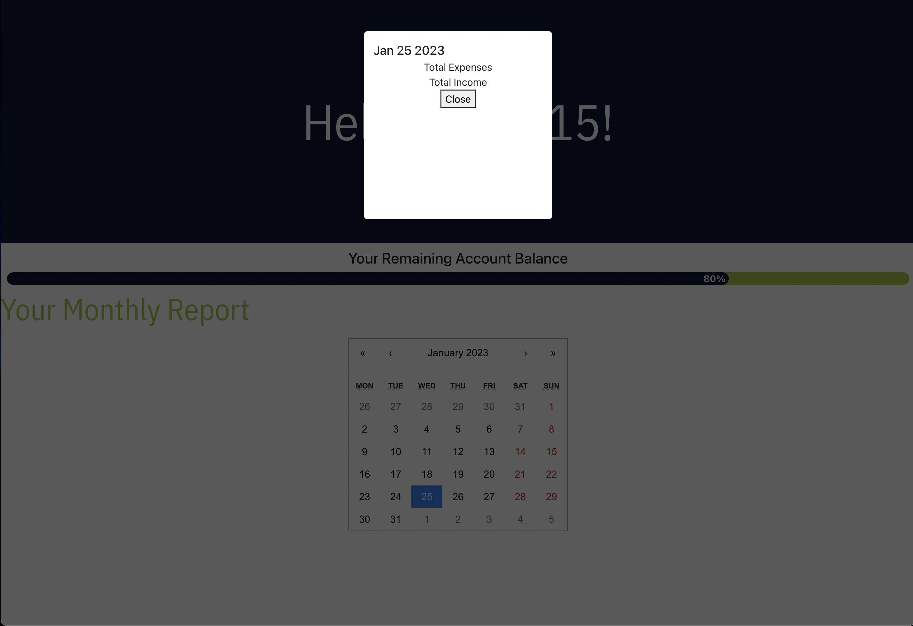

On the expenses page, the user can see a list of their input expenses as well as an option to add another expense. 
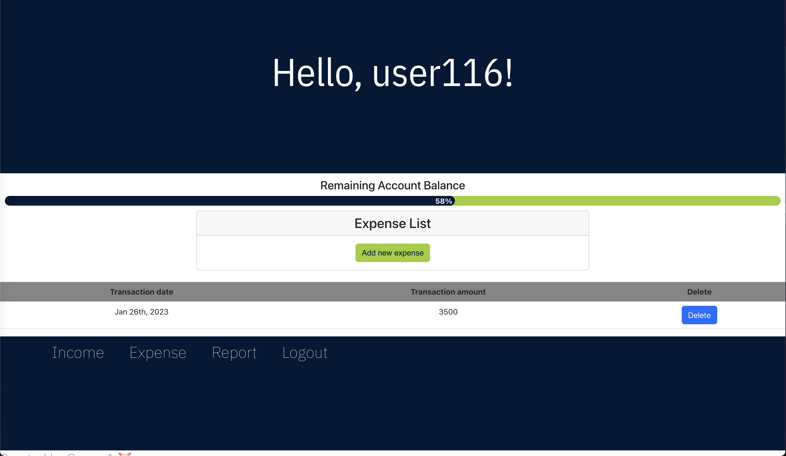
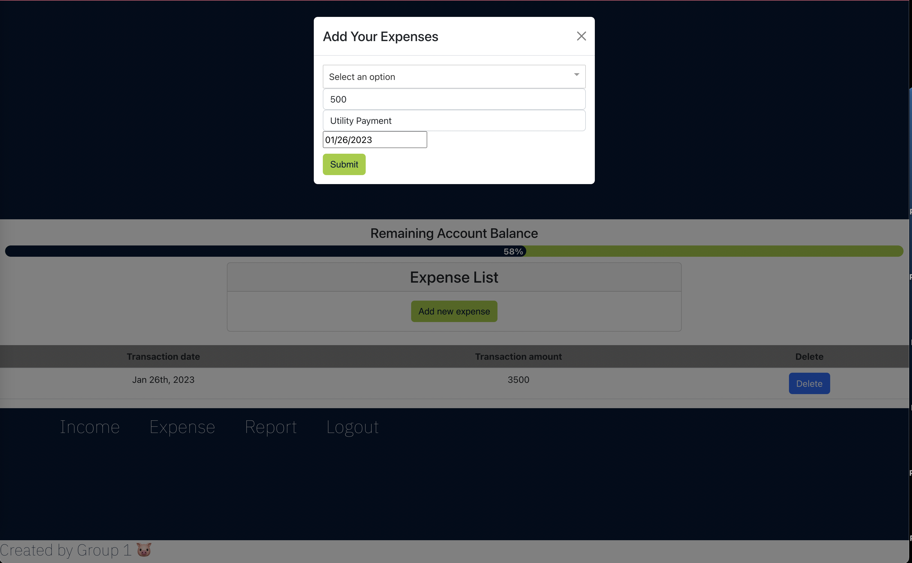

And in the income section, the user can see a list of their income sources as well as an option to add another income transaction. This is perfect for users with multiple income sources. 
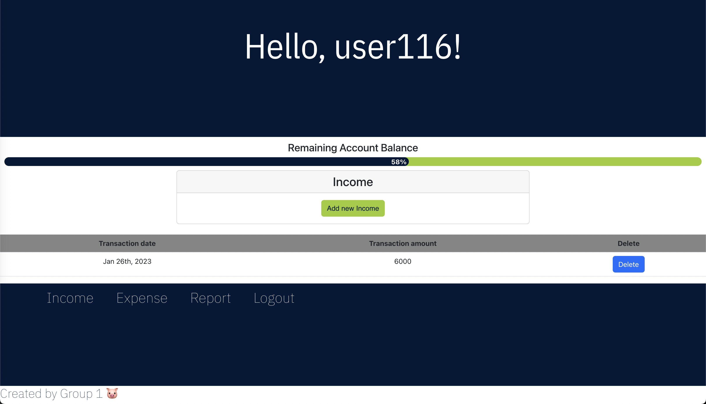
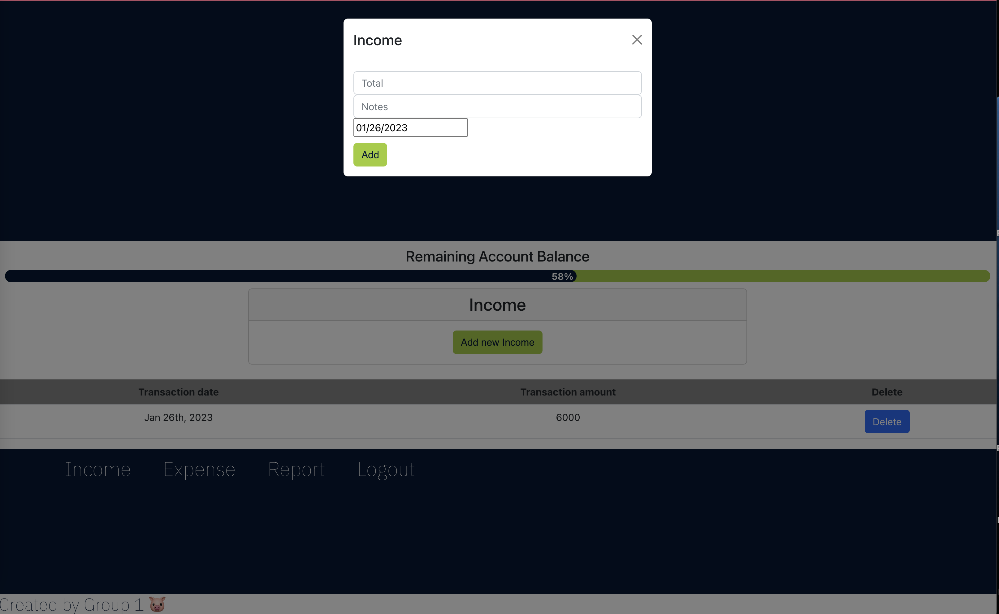

## Support 

For support, the user can reach out to the repo owner or any of the other contributors of this project. 

## Roadmap

Future iterations of this project will include a feature to connect to the user's bank account, a feature to connect to a payment application (e.g. PayPal, Venmo), and a way for their expenses as well as their income to automatically populate in their respective sections. 

## Acknowledgements 

This project was made by <a href="https://github.com/TBertazoli">Tatiana Bertazoli</a>, <a href="https://github.com/Darbybiddy">Darby Biddy</a>, <a href="https://github.com/Patrick-Duffy202">Patrick Duffy</a>, <a href="https://github.com/emsaw721">Emily Hill</a>, and <a href="https://github.com/deadseal001">Wenbo Li</a>. 

The badges for this README were acquired <a href="https://dev.to/envoy_/150-badges-for-github-pnk">here</a> and <a href="https://shields.io/">here</a>.

## License 
[MIT](https://choosealicense.com/licenses/mit/)

## Project Status 

I am having problems getting the actual data displayed on the  Progress Report page. We have our transaction imported as a group of objects, in an array, in an object, and react doesn't like arr.filter(); 

